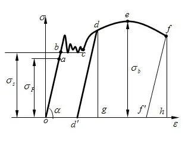

# 材料分类
## 材料类型
### 分类
1. 金属材料
2. 高分子材料
3. ==陶瓷材料==
4. 复合材料

## 原子结合键
### 金属键
1. 没有方向性
2. 良好导电性
3. 良好导热性

### 共价键
1. 键与键之间有固定方向关系
2. 硬而脆, 塑性差
3. 导电性能差

### 离子键
1. 结合性较强
2. 常温导电性差

### 范德瓦尔键
1. 弹性模量, 强度低
2. 熔点, 硬度低

# 材料性能
## 拉伸试验 P12

### 符号表示
1. $R$ 或 $\sigma$ 应力 $R=F/S_o$
2. $S_o$ 原始截面面积
3. $e$ 或 $\varepsilon$ 拉伸率 $e=(l-l_o)/l_o$

### 拉伸实验的过程
1. 弹性变形
2. 弹塑性变形
3. 断裂

### 弹性
1. 弹性变形阶段 $oa$ 段 , 应力于拉伸率成正比, 去除应力后回复 
2. $E$ 弹性模量 $E=R/e$ 度量材料的刚度
3. $R_e$ 或 $\sigma_F$ 弹性极限 不产生永久形变的最大应力

### 强度
1. $ac$ 段 , 除弹性变形外还有塑性变形
2. $R_eH$ 上屈服应力, 材料发生屈服而应力首次下降前的最大应力(弹性后的第一个突起)
3. $R_eL$ 下屈服应力, 材料屈服期间最小应力
4. $R_{p0.2}$ 规定塑性延伸强度, 塑性延伸 0.2% 的应力  
5. $\sigma_s$ 屈服强度, 通常采用下屈服应力 $R_eL$
6. $R_m$ 或 $\sigma_b$ 抗拉强度, 对应图上的 $e$ 点, 代表材料在发生破裂前承受的最大应力

### 塑性
1. 断裂前发生永久变形的能力, 下标 $u$ 表示断裂前的量 
2. $A$ 伸长率 $A=(l_u-l_o)/l_o$
3. $Z$ 断面收缩率 $Z=(S_o-S_u)/S_o$

## 硬度
### 布氏硬度
1. 使用硬质合金钢球压入被测试式样
2. 测量压痕的平均直径
3. 压痕直径越大, 布氏硬度值越小
4. 符号 HBW

### 洛氏硬度
1. 使用一定形状的压头
2. 根据压痕深度来计算硬度值
3. 压痕越深, 硬度越小
3. 不同压头与载荷, 使用不同硬度标尺
4. 符号 HR(A,B,C,...) 第三个字母表示标尺

### 维氏硬度
1. 正方形金刚石压头
2. 根据压痕对角线长度计算硬度
3. 符号 HV

### 肖氏硬度
1. 金刚石冲头落到式样上, 测量回跳高度
2. 回跳高度越高, 硬度越大
3. 符号 HS

### 莫氏硬度
1. 是一种==划痕硬度==

## 冲击韧度
1. 材料在冲击载荷作用下抵抗变形和断裂的能力称为为冲击韧度, 用 $a_k$ 表示
2. 使用摆锤冲击带缺口的式样实验测量, 摆锤前后最大高度 $H_1$, $H_2$, 式样缺口横截面积 $S$
3. 冲击吸收能量 $K=GH_1-GH_2$
4. 冲击韧度 $a_k=K/S$

## 断裂 P21
由于裂纹存在, 其尖端存在应力集中, 裂纹尖端的应力超过断裂应力, 快速扩散, 导致断裂
### 裂纹类型
1. (I 型)张开型 受力垂直于裂纹, 危害最大
2. (II 型)滑开型 受力平行于裂纹, 平行于板材
3. (III 型)撕裂型 受力平行于裂纹, 垂直于板材

### 断裂韧度
1. $K_{I}$ 一个表示第一型裂纹的复合力学参量
2. $K_{IC}$ 断裂韧度 裂纹快速扩张时的临界 $K_{I}$

## 疲劳强度 P22
1. 疲劳断裂是一个损伤积累的过程
2. 疲劳极限指材料在无限次交变应力下而不发生疲劳断裂的最大应力
3. 疲劳曲线 $S-N$, 即金属在应力 $S$ 作用 $N$ 次后断裂
4. 存在一个 $S_{-1}$, 使曲线趋于水平, 称为材料对称循环的疲劳极限或疲劳强度

## 物理化学性能
* 不属于力学性能
1. 热胀性
2. 导热性
3. 电性能
4. 耐蚀性

## 工艺性能
* 不属于力学性能
加工过程中表现出来的性能

# 材料的晶体结构
## 晶体结构
### 晶格常数
晶胞三条棱边 $a,b,c$ 与夹角 $\alpha,\beta,\gamma$, 对于立方晶系只需要取 $a$

### 晶系
存在 7 个晶系, 7 种简单晶胞, 7 种复杂晶胞, 共 14 种晶胞

### 晶面与晶向

#### 晶向指数
* 若干结点连成的表示不同空间方位的直线称为晶向
1. 求所引直线上一点的坐标值
2. 将坐标值==按比例==化为最小整数
3. 将坐标值用==方括号==框出
eg. $[uv\overline{w}]\;[010]$
4. 一个晶向指数表示一组相互平行, 方向相同的所有晶向直线
5. 晶向族 使用==尖括号==表示, 表示 $uvw$ 任意组合/取负号下的一组晶向
eg. $<100>$ 可表示 $[100],[0\overline{1}0],[001]$ 等六个不同晶向

#### 晶面指数
* 通过若干结点构成的二维平面
1. 原点避免在待定晶面上
2. 求出待定晶面在原点坐标轴上的截距, 如果与坐标轴平行则取 $\infty$
3. 将==截距值==变为==倒数==
4. 将三个倒数==按比例==化为最简整数
5. 将坐标值用==圆括号==框出
    eg. $(uvw)\;(010)$
6. 一个晶面指数表示一组平行的晶面
7. 晶面族 使用==花括号==表示, 表示 $uvw$ 任意组合/取负号下的一组晶向
eg. $\{100\}$ 可表示 $(100),(0\overline{1}0),(001)$ 等六个不同晶向

#### 统一要求
1. 以晶格常数为测量单位
2. 晶向/面原点不一定是晶格原点
3. 将坐标值==按比例==化为最小/简整数
4. 坐标值不用标点分开
5. 负数则在对应坐标上加注横线

### 原子密度
导致金属各向异性的原因之一
#### 晶向原子密度
晶向原子数 / 晶向在一个晶格的长度
1. 晶向原子数不一定是 1, 如果只过半径则为 1/2
2. 晶格的长度不一定是 $a$, 晶向族 $<110>$ 的晶格长度为 $\sqrt{2}a$
#### 晶面原子密度
晶面原子数 / 晶面在一个晶格的面积
1. 晶面原子数不一定是 1, 根据截面所占的比例计算
2. 晶面的面积不一定是 $a^2$, 且可能为三角形 $\{111\}$

## 纯金属的晶体结构
### 体心立方
1. 晶胞 原子位于晶格的八个顶点与中心
2. 原子数 2
3. 原子半径(使用晶格常数表示) $r=\frac{\sqrt{3}}{4}a$
4. 致密度 68%
5. 最密晶向 $<111>$
6. 最密晶面 $\{110\}$

### 面心立方
1. 晶胞 原子位于晶格的八个顶点与6个面中心
2. 原子数 4
3. 原子半径 $r=\frac{\sqrt{2}}{4}a$
4. 致密度 74%
5. 最密晶向 $<110>$
6. 最密晶面 $\{111\}$

### 密排六方
1. 晶胞 上下为顶点六边形, 中间为面上三角形
2. 原子数 6
3. 原子半径 $r=\frac{1}{2}a$
4. 致密度 74%

