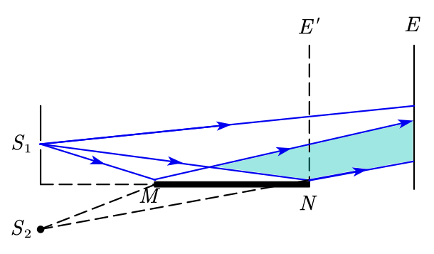
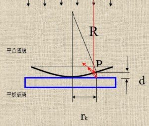
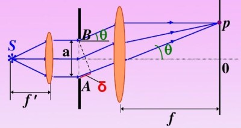
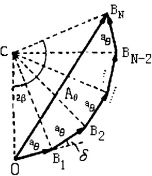
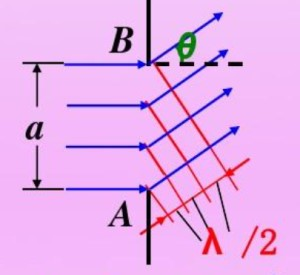

# 光学
## 电磁波理论
### 惠更斯原理

波面上的各点都可以看成产生子波 (球面波) 的波源, 这些子波的包络面可以看成新的波面

#### 波的折射
* 波在入射两种介质的界面时, 将会产生折射
* 这是由于波在两种介质的速率不同导致的
* 如图, 平面波在界面上产生的子波在新介质中传播速率减慢, 导致最先产生的子波波面与最后到达的子波源切线改变, 导致波面的法向改变
* 对于入射角 $i$, 折射角 $\gamma$, 有折射定律 $$n_i\sin i=n_\gamma\sin\gamma$$

### 光波性质
1. 光是电磁波, 其在真空中的传播速度最快, 且为常量 $c$, 因此有 $$c=\lambda\nu$$
2. 将光速与光波在透明介质传播速率的比值定义为折射率 $$n=\frac{c}{v}>1$$
3. 光波中 $\vec{E}$ 与 $\vec{H}$ 垂直, 使用 $\vec{E}$ 表征光波, 将 $\vec{E}$ 的振动称为光振动
4. 沿 $x$ 方向的平面光波可表示为 $$\vec{E}(x,t)=\vec{E_0}cos(\omega t-\frac{2\pi}{\lambda}x+\varphi_0)$$
5. 人眼直接观察到的为光强, 即光波的平均能流密度满足 $I\propto E_0^2$
6. 由于原子辐射具有随机性与间歇性, 因此一般光源的 $\omega,\varphi_0$ 仅持续极短的 $\Delta t\approx 10^{-9}s$, 并且随时间在一个区间内快速变化
7. 根据傅里叶分析可得 $$\Delta\nu\cdot\Delta t=0$$
光源的持续时间越短, 频率的变化范围越大 
8. 定义波列 $L=c\Delta t$, 表现出光源发出的一列稳定光波的长度

### 光波叠加
同频率光波叠加类似同频率简谐波的叠加, 满足旋转矢量的平行四边形叠加的余弦定律 $$E_{12}^2=E_{10}^2+E_{20}^2+2E_{10}E_{20}\cos\Delta\varphi$$
其中 $$\Delta\varphi=-\frac{2\pi}{\lambda}x_{1}+\varphi_{10}+\frac{2\pi}{\lambda}x_{2}-\varphi_{20}$$ 为两列波的相位差(==包括路程与初相位==)

在人眼观测中, 光波叠加为一段时间内的平均光强, 积分计算可得 $$I\propto \overline{E^2}=I_1+I_2+2\sqrt{I_1I_2}\cdot\overline{\cos\Delta\varphi}$$ 

#### 非相干叠加
对于两个普通光源, 其 $\varphi_0$ 无关系, 并且不断变化, 因此认为 $\overline{\cos\Delta\varphi}=0$, 两个普通光源的光波叠加后 $I=I_1+I_2$

#### 相干叠加
当叠加光波相干(如来自同一个光源), 此时两列波 $\varphi_0$ 相同, 波程差来自光程 $x$, 因此对于一个点, $\overline{\cos\Delta\varphi}=C$, 并在平面上显现出明暗相间的干涉条纹

可得明暗条纹的条件为 $$\Delta\varphi=\begin{cases}\pm 2k\pi,&明条纹\\\pm (2k+1)\pi,&暗条纹\end{cases}(k=\pm 0,1,2,\dots)$$

#### 相干条件
1. 各光波频率相同
2. 各光波有平行分量(能够投影到一个平面上)
    * 由于光为横波, 两列光波的光矢量在空间中不一定平行, 需要将其中一个光矢量投影到另一个上计算
    * 垂直分量的光矢量构成背景光
    * 当光矢量垂直, 则不构成相干光
3. 光振动的相位差保持稳定(从同一光源分光或使用激光源)

### 光程
1. 无论在何种介质中, 光波的==频率 $\nu$== 始终不变, 但波长 $\lambda$ 与波速 $v$ 改变, 因此, 介质中的波长为 $$\lambda_n=\frac{\lambda}{n}$$
2. 因此当一列光波经过了不同介质后, 与光源的相位差为 $$\Delta\varphi=-(\frac{2\pi}{\lambda_1}r_1+\frac{2\pi}{\lambda_2}r_2)=-\frac{2\pi}{\lambda}(n_1r_1+n_2r_2)$$
3. 定义光程 $d$ $$d_k=\sum n_ir_i$$
4. 因此初相位相同的相干光源的相位差为 $$\Delta\varphi=\frac{2\pi}{\lambda}(d_2-d_1)=\frac{2\pi}{\lambda}\delta$$
带入 $\frac{2\pi}{\lambda}\delta=\Delta\varphi$
$$\delta=\begin{cases}\lambda k,& 明条纹\\\lambda(k+\frac{1}{2}),& 暗条纹\end{cases}(k=\pm 0,1,2,\dots)$$

#### 物象间等光程性
1. 光学仪器 (透镜, 球镜) 的物点 (光源) 和像点 (焦点) 之间的各个光线光程相同
2. 对于平行光源, 物点为垂直于光线的平面
3. 认为平行光聚焦于无穷远处, 来自无穷远处的光源

### 半波损失
1. 光从波疏介质到波密介质时
2. 当入射角 $i\approx 90^{\circ}$ 或 $i\approx 0^{\circ}$
3. 反射光与入射光的相位将相差 $\frac{\pi}{2}$

#### 光介质
1. 将折射率 $n$ 大的物质称为波疏介质 (如平面镜, 玻璃)
2. 将折射率 $n$ 小的物质称为波密介质 (如真空, 空气)
3. 当出现平面镜时, 很有可能发生半波损失

## 分波阵面干涉
### 杨氏干涉

子光源 $S_1,S_2$ 来自同一个光源(波阵面), 因此为相干光, 当$SS_1=SS_2$ 时, 两个子光源在 $P$ 点的光程差为 $$\delta=r_2-r_1\approx S_2N\approx d\sin\theta\approx d\tan\theta=d\frac{x}{D}$$
其中 $D\gg d,x;\theta\approx 0$

$x$ 体现了屏幕上 $p$ 点的明暗情况, 因此有 $$x=\begin{cases}\lambda\frac{D}{d}k,& 明条纹\\\lambda\frac{D}{d}(k+\frac{1}{2}),& 暗条纹\end{cases}(k= 0,\pm 1,2,\dots)$$ $k$ 为条纹级数, $k=0$ 为零级明条纹

其中屏幕上两明条纹 / 暗条纹间距相同 $$\Delta x=\lambda\frac{D}{d}$$ 因此条纹间距与光路中是否有介质无关
但光路中的介质将改变 $\delta$, 导致条纹移动

### 劳埃德镜

1. 可将 $S_1$ 在平面镜中的的虚像视为相干光源光源 $S_2$, 即杨氏干涉中的第二条狭缝
2. 由于光线从空气入射平面镜将产生半波损失, 因此干涉条纹的明暗与杨氏干涉相反
3. 由于光源为虚光源, 因此条纹只有上半部分, 级数 $k\ge 0$

### 时间相干性
杨氏干涉中, 当两列光的光程差 $\delta >L=c\Delta t$ 时, 即两列光虽然分自同一个光源, 但两列光相差时间过长, 光源的 $\omega$ 与 $\varphi_0$ 以发生变化, 不再相干, 称为时间相干性

普通光源中, 由于波列长度(相干长度) $L$ 极小, 因此产生相干的 $\delta$ 较小, 相干性较差

### 空间相干性
杨氏干涉中, 缝光源 $S$ 也具有宽度 $b$, 在缝宽边缘也可视为另一个光源 $S'$, 也会通过双缝产生干涉条纹

由于 $S'$ 到双缝距离 $R_i$ 不同, 会产生附加光程差 $$\delta_b=R_2-R_1\approx\frac{bd}{2R}$$
其中 $R$ 为单缝与双缝的垂直距离

如果 $\delta_b=\frac{\lambda}{2}$, 缝边缘产生的干涉条纹与中心产生的条纹恰好相反, 将导致干涉条纹消失, 因此定义 $$\frac{b_0d}{2R}=\frac{\lambda}{2}$$

仅当光源的 $b<b_0$ 才能产生可观察到的干涉条纹, 可以此筛选特定的 $\lambda$ 或 $b$

## 分振幅干涉
即利用光的反射与折射获取相干光源的干涉

### 等倾干涉

1. 将分解光源的两层薄膜平行的干涉称为等倾干涉
2. 由于两列相干光平行, 因此认为相遇于无穷远处, 或需要透镜聚焦
3. 注意薄膜介质与薄膜两侧介质的折射率 $n$, 可能会在 $A,B$ 处产生半波损失

#### 等倾干涉分析
根据折射定律 $$n_1\sin i=n\sin\gamma$$
在不考虑半波损失的条件下 ($n_1<n<n_2$, 两光路均有半波损失), 如图可得 (完整公式不要求) $$\delta=n(AB+BC)-n_1AN=2nd\cos\gamma=2d\sqrt{n^2-n_1^2\sin^2i}$$
$k$ 级亮条纹满足 $$\delta=2d\sqrt{n^2-n_1^2\sin^2i}=k\lambda(k=1,2,\dots)$$

对于点光源 $S$, 可得到以下规律
1. 干涉条纹仅与入射角 $i$ 有关, 因此称为等倾干涉, ==当 $S$ 为点光源时==, 入射角为 $i$ 的点可构成一个圆, 从而产生明暗相间的圆形干涉条纹
1. 越靠近中心, $i$ 越小, 条纹级数越高, 相应的, 边缘级数小
1. 增大 $d$ 时, $\delta$ 增大, 中心圆环的级数增大, 表现为圆环从中心涌出
1. 根据 $\delta=2nd\cos\gamma=k\lambda$, 边缘条纹的级数 $k$ 较小, 对应的 $\gamma$ 较大, 根据 $y=\cos\theta$ 的图像可得, ==边缘条纹的级数变化快, 间距窄, 中心条纹间距宽==

对于平行光源 $S$
1. 当 $S$ 为平行光源时, 各个入射点 $i$ 相同, 只能得到一个条纹/点
1. 对于垂直入射的自然光, $\delta=2dn$, 表现为部分 $\lambda$ 干涉极大, 部分干涉极小 (肥皂泡原理)

对于不同的介质与观察方向
1. 当仅有一个界面发生半波损失时, 需要在光程中考虑附加光程差 $\delta'=\frac{\pi}{2}$, 如 $n_1,n_2>n$, 此时将得到相反的图样
1. 从反方向观察, $B$ 处折射光与 $C$ 处反射再折射光也将产生等倾干涉, 并且条纹与正面观察的相反 (由于半波损失情况与正面相反导致, 符合能量守恒)

### 等厚干涉

1. 将分解光源的两层薄膜成一定角度的干涉称为等厚干涉
1. 实际问题中, 只讨论 $i=0$ 即垂直入射的情况
1. 由于厚度相同的位置干涉情况相同, 因此称为等厚干涉
1. 等厚干涉中, 相干光的光程差为 $\delta=2nd$ (经历了折射与反射, 需要记两倍的厚度 $d$)

#### 劈尖干涉
当 $\theta\approx 0$, 距离棱角 $l$ 处的光程差为 $$\delta=2nl\tan\theta\approx 2nl\theta=k\lambda(亮条纹)$$
干涉中相邻的条纹距离为 $$\Delta l=\frac{\lambda}{2n\theta}$$
一般劈尖中心为空气, $n=1$

根据等候干涉的特点, ==一条连续条纹对应的厚度相同==, 因此可以此判断薄膜表面的凹陷

#### 增透膜
确定薄膜厚度, 使反射光为干涉极小, 增大透射光光强

#### 牛顿环

1. 环的半径与厚度关系 $$r^2=2Rd-d^2\approx 2Rd$$
1. 由于牛顿环中透镜与平板为玻璃, 因此存在半波损失
1. 因此可得暗环半径满足 (空气 $n=1$) $$r=\sqrt{kR\lambda}(k=0,1,2,\dots)$$
1. 与等倾干涉不同, 越接近外层, 条纹级数越大
1. 与等倾干涉类似, 越接近外层, 条纹越迷
1. 由于 $k=0,r=0$, 因此中心条纹为暗纹

#### 迈克尔逊干涉仪

1. 引入补偿板 $P_2$, 使两束光均经过两次透光板, 保证两束光除空气外光程相同
1. 干涉仪将光源分为折射 $1$ 与反射 $2$ 两束, 一束来自可动镜 $M_2$, 另一束来自固定镜 $M_1$, 其虚像 $M_1'$ 与 $M_2$ 平行
1. 假设 $M_1'$ 与 $M_2$ 距离相同, 由于光束在反射镜来回一次, 因此两束光的光程差为 $\delta=2dn$, 通过移动 $M_2$, 改变光程差与成像 
1. 当光源为点光源 (散射面光源), 得到等倾干涉的圆形图样
1. 当 $M_1'\nparallel M_2$, 光源为平行光, 得到等厚干涉图样

## 夫琅禾费衍射

* 根据惠更斯原理, 光波在狭缝处可分解为无数个子光源, 光屏上的点 $P$ 为子光源共同聚焦的结果
* 当入射狭缝的光源为平行光时, 称为单缝夫琅禾费衍射

### 叠加法推导单缝夫琅禾费衍射

1. 将子光源在 $p$ 点的光振动以相量形式表示为 $d\vec{B}=dE\angle d\varphi_0$
1. 由相邻光振动的光程差 $d\delta\approx dx\sin\theta$ 可得 $$d\varphi_0=\frac{2\pi d\delta}{\lambda}=\frac{2\pi dx\sin\theta}{\lambda}$$
1. 将子光源的振动相量积分有 $$E_0=\int dE\\\varphi'=\int d\varphi_0=\frac{2\pi a\sin\theta}{\lambda}$$ 
1. 因此振动相量叠加后为一圆弧, 弧长为 $E_0$, 圆心角为 $\varphi_0'$, 在 $p$ 点的振动相量 $\vec{B}$ 为弧的弦, 定义 $\alpha=\varphi'/2=\frac{\pi a\sin\theta}{\lambda}$ , 因此叠加振幅 $$E=2\frac{E_0}{\varphi'}\cdot\sin\frac{\varphi'}{2}=\frac{E_0\sin\alpha}{\alpha}$$
1. 根据惠更斯原理, $E_0\propto a$, 因此最大光强与缝宽成正比

#### 夫琅禾费衍射光强分析

实际分析中通常分析光强分布 $$I\propto E^2=I_0(\frac{\sin\alpha}{\alpha})^2$$ 其中, $I_0\propto a^2$, 最大光强与缝宽的平方成正比

1. 定义 $\alpha=0$ 为中央主极大, 亮度最高
1. 定义 $k$ 级次极大位置为(==注意 $k$ 不可取 $0$==) $$\alpha=(k+\frac{1}{2})\pi\;(k=\pm 1,2,3,\dots)$$
1. 定义暗纹位置 $$\alpha=k\pi\;(k=\pm 0,1,2,\dots)$$
1. 由于 $\theta\approx 0$, 因此 $\alpha=\frac{\pi a\sin\theta}{\lambda}\approx \frac{\pi a\theta}{\lambda}$ 定义中央主极大到一侧的暗纹宽度为中央主极大的半角宽 $$\Delta\theta=\frac{\lambda}{\alpha}$$
1. 当透镜到屏幕距离为 $f$ 时, 屏幕上中央主极大的线宽为 $$\Delta x=2f\tan\Delta\theta\approx 2f\frac{\lambda}{\alpha}$$
1. 综上可得, 单缝缝宽 $a$ 越小, 主极大亮度 $I_0$ 越低, 但宽度 $\Delta x$ 越大

#### 半波带法

* 将缝宽向光线方向的投影以宽度 $\lambda/2$ 等分, 反过来将入射光源分为 $n$ 部分
* 各部分子光源间的光程差为 $\lambda/2$, 因此每两部分的光线相干抵消, 最终叠加得到暗条纹
* 因此假设 $a\sin\theta=\frac{\lambda\alpha}{\pi}=n\lambda/2$
    1. $n=0$, 所有子光源的光程差为 $0$, 为主极大
    1. $n$ 为偶数, 子光源相互抵消, 为暗纹
    1. $n$ 为奇数, 至少有一部分子光源没有被抵消, 为次极大

### 双缝夫琅禾费衍射

