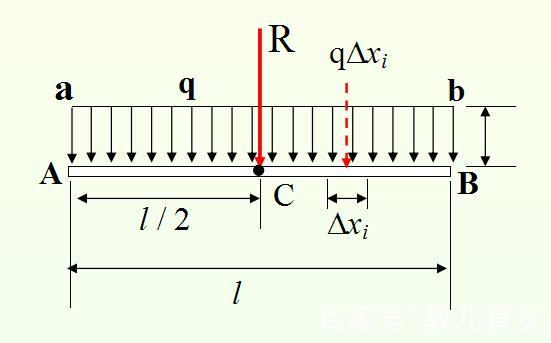
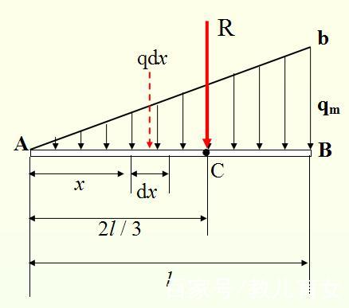

# 静力学
## 静力学基础
### 静力学公理
#### 二力平衡
只受两个力的单个刚体 (任意形状) 处于平衡状态时, 两个力一定大小相同, 方向相反, 且在同一直线上

#### 力的可传导性
单个刚体上的力可沿其作用线移动而不改变效果

#### 三力交会平衡定理
受三个不平行的力的单个刚体处于平衡状态时, 三个力必定共面且交于一点

#### 作用力与反作用力
相互作用的两个物体间总存在等值, 反向, 共线且分别作用于两个物体的一对力

#### 刚化公理
平衡状态下, 可将变形体视为刚体 (平衡状态下, ==可将柔绳等作为刚体==)

### 力偶
* 两个等值, 平行, 反向的力组成的力系称为力偶
* 力偶间的最短距离 (==垂直==距离) 称为力偶臂 $d$
* 定义平面力偶矩 $M=\pm Fd$, 正负号取决于转动正方向
* 力偶矩与力偶的位置无关

### 约束
约束处存在约束力, 约束力大小未知, 根据主动力变化而变化

#### 光滑接触面约束
约束力为接触点的==公法线==方向 (不一定是竖直方向)

#### 铰链约束
* 铰链对两个连接体的约束力等值反向, 方向任意, 通常分解为 两个正交的未知力
* 当铰链上有两个以上物体时, 对各个物体的约束力之和为 $0$

#### 固定铰链约束
与铰链约束相同, 由于地面通常静止, 因此铰链静止

#### 活动铰链支座
约束力垂直于活动方向

#### 插入端约束
插入端的各点收到多个力, 可等效为两个正交的约束力于一个约束力偶

### 受力分析
1. 未知力以正交分量的形式表现
1. 力的方向 (作用线) 确定, 大小未知时, 指向可以任意 (作为正方向)
1. 可用三力汇交提前确定部分力的方向
1. 先整体再部分, 分析部分注意反作用力
1. 整体受力图不需要表示内力 

## 平面力系的简化
### 力平移定理
刚体内的力 $F$ 移动到任意一点 $B$ 后得到 $F'$, 为了不改变力的作用效果, 需要再补充一个附加力偶, 力偶矩大小 $M=M_{BF}$, 即原来的力 $F$ 对新点 $B$ 之矩

### 分布力系的化简
* 分布力系图示中的细实线 $ab$ 表现了分布力强度 $q(N/m)$ 随位置 $x(m)$ 的变化关系
* 根据积分可得, 等效合力的大小即图形面积
* 将分布力向分布力强度图的形心 $C$ 简化可不产生附加力矩
* 假设 $q_0=bB$

#### 矩形分布力系

* 简化后等效合力为 $$R=q_0l$$
* 无附加力矩的简化点为 $$d=\frac{l}{2}$$

#### 三角形分布力系

* 简化后等效合力为 $$R=\frac{q_0l}{2}$$
* 无附加力矩的简化点为 $$d=\frac{2}{3}l$$

### 平面力系的平衡条件
* 当平面力系平衡时, 将会满足 $$\vec{F_R}=\sum \vec{F}=0\\M_O=\sum M+\sum Fd=0$$ 其中 $\vec{F_R}$ 为总和力, $M_O$ 为所有力对任意点之矩, 包括力偶矩
* 根据力系的化简可得, 一个平衡状态下的刚体可以提供 $3$ 个平衡方程
* 可通过指定方向 $F_x=0$ 于对任意点 $O$ 取矩得到三个平衡方程
* 三个方程中对两点 $A,B$ 取矩时, $AB$ 不能与 $F$ 分解方向平行
* 三个方程对三点取矩时, 三点不能共线 
* 对于二力杆, 取矩无意义, 仅有两个方程

### 平衡方程解题技巧
1. 可以将平衡状态下的组合体 (部分整体) 视为一个刚体使用平衡方程
1. 组合体中, 一个刚体可提供三个方程, 约束可提供等同于其约束反力数的方程, 无论从组合体还是刚体分析, 总方程数不变
1. 优先分析整体, 避免内力
1. 优先对多力交汇点取矩, 减小计算量
1. 优先向不求力的垂直方向分解, 减小计算量
1. 检查: 
    1. 受力分析
    1. 方程是否少力, 少力矩
    1. 确认力矩方向

### 桁架分析
#### 桁架构造
1. 所有杆件和受力均在同一平面内
1. 以三角形为结构基础
1. 支座反力量不超过 $3$ 个
1. 所有杆均为二力杆

#### 内力计算

1. 以杆受拉方向为内力正方向 (因此节点所受的反力方向向外)
1. 沿指定方向截切桁架, 将得到部分视为刚体, 除原本所受外力外, 还受到沿被截切方向的, 来自被截切杆的内力 (拉力的反作用力, 方向与拉力相反)
1. 尽量一次仅截出三个未知量, 保证三个平衡方程可解

#### 零力杆分析
由于均为二力杆, 因此外力必定在节点处
内力计算前, 可先移去零力杆, 简化计算

1. 一点两杆无外力
1. 一点两杆有外力, 外力沿其中一杆的方向, 则另一杆为零力杆
1. 一点三杆无外力, 其中两杆共线, 第三杆为零力杆

## 摩擦
### 滑动摩擦力
1. 作用在接触点, 沿接触点切线方向
1. 总是与运动趋势相反
1. 随主动力增大而增大, 满足 $$0\le F_s\le F_{max}=F_Nf_s$$

#### 摩擦自锁
定义 $$\tan\varphi_f=f_s=\frac{F_{max}}{F_N}$$ 当物体所受外力 $\vec{F_R}$ 与接触点的==法线夹角== $\varphi<\varphi_f$ 时, $\vec{F_R}=\vec{F_N}+\vec{F_s}$, 物体总是保持平衡, 称为摩擦自锁

注意支持力 $F_N$ 的方向为法线方向, 即垂直于接触面

### 滚动摩擦力
* 实际情况下, 接触面为一个复杂的力系, 但可以分解为 $F_s,F_N,M_f$, 其中 $M_f$ 为滚阻力偶
* 滚阻力偶总是阻止物体滚动
* 随主矩增大而增大, 满足 $$0\le M_f\le M_{max}=F_N\delta$$
* 对于面接触中, 由于只能相对点翻滚, 因此在临界状态下, 可视为接触点为翻滚点的点接触 ($F_s,F_N$ 作用于此点)

### 摩擦平衡分析
在摩擦平衡分析中, 求临界力/质量时, 仅通过平衡方程一般无法求出所有力, 因此要假设部分摩擦处于临界状态作为已知条件

1. 先比较未知力 (包括未知摩擦力与摩擦滚阻) 与系统平衡方程数, 得到需要补充的临界条件数
1. 轮子逆时针滚动时, 质心向左移动, 存在顺时针的滚阻, 但可能不存在向左的滑动摩擦力 (没有相对滑动)
1. 轮子逆时针滚动时, 更可能出现向右滑动的趋势, 即打滑, 此时滑动摩擦力与滚阻的运动效果均与主矩相反, 更可能达到临界
1. 对于任何物体均存在滚动与滑动两种趋势, 且均有两个方向 (如果没有给出 $\delta$, 则不考虑滚动)
1. 由于 $\delta$ 一般较小, 因此滚动通常会是临界条件

## 空间力系分析
### 空间力矩论
#### 对点之矩
* 对一固定点 $O$ 的力矩 $\vec{M_O}=\vec{r}\times\vec{F}$
* ==其中 $r$ 为点 $O$ 到力作用点的矢量==
* 与平面不同, 此时力矩为矢量

#### 对轴之矩
对于空间的轴, 只有垂直于轴的分量有转动效果, 因此力矩为 $$M_{z}=\pm hF_{xy}$$

* $h$ 为力 $F$ 作用点到轴的距离
* ==力对轴之矩等于力对轴上任一点之矩在轴上的投影== (用于计算任意轴的矩) $$M_{l}=\vec{M_O}\frac{\vec{l}}{|l|}$$

#### 空间力偶
* 定义空间力偶矢 $$\vec{M}=\vec{r}\times\vec{F}$$
* 其中 $\vec{r}$ 为力偶中两力作用点的矢量
* 空间力偶的具体指向可通过右手螺旋定则确定
* 空间力偶性质与平面力偶相同, 可以自由移动

### 空间力系的化简
#### 空间力系的化简结果
对于任意空间力系可化简为 $\vec{F_R},\vec{M_O}$

1. $\vec{F_R}=0,\vec{M_O}=0$, 力系平衡
1. $\vec{F_R}\neq 0,\vec{M_O}=0$, 仅有一个力, 力系最简
1. $\vec{F_R}=0,\vec{M_O}\neq 0$, 无论向那点化简, 始终为一个力偶
1. $\vec{F_R}\neq 0,\vec{M_O}\neq 0$, 向其他点化简可以消去 $\vec{M_O}$, 得到 $\vec{F_R}\neq 0,\vec{M_O}=0$
1. $\vec{F_R}\parallel\vec{M_O}\neq 0$, 无法化简, 为一个力螺旋

#### 空间力系的平衡条件
根据力系的化简可得, 一个平衡状态下的空间刚体可以提供 $6$ 个平衡方程
$$\sum F_x=0\;\sum F_y=0\;\sum F_z=0\\
\sum M_x=0\;\sum M_y=0\;\sum M_z=0$$

与平面类似, 可以对更多的轴取矩, 但不能对通过同一点的 $3$ 根以上的轴取矩, 也不能对 $3$ 根以上的平行轴取矩

* 选取轴时, 不一定是在已知杆上, 也可以是空间中的两点连线
* 选择与未知量共面的轴, 避开求未知量

# 运动学
## 质点运动学
### 自然坐标系
设质点轨迹的指向运动方向的切向为 $\vec{\tau}$, 指向曲率圆心的法向 $\vec{n}$, 将 $\vec{\tau},\vec{n}$ 构成的坐标系称为自然坐标系

#### 速度表示
自然坐标系下, $\vec{\tau}$ 即速度的方向, 因此 $\vec{v}=v\vec{\tau}$

#### 加速度分解
自然坐标系下, 加速度可分解为切向加速度 $a_t$ 与法向加速度 $a_n$, 根据微分关系可表示为 $$\vec{a}=a_t\vec{\tau}+a_n\vec{n}=\frac{dv}{dt}\vec{\tau}+\frac{v^2}{\rho}\vec{n}$$
其中 $v$ 为速度的大小, 不是矢量; $\rho$ 为轨迹的曲率半径, 可通过此方法求出运动轨迹的曲率半径

### 点运动的合成
将点的运动向静系和动系分解, 可得到三种运动

1. 绝对运动 (absolution) 动点相对于静系的运动
1. 相对运动 (relation) 动点相对于动系的运动
1. 牵连运动 (entrainment) 动系相对于静系的运动

解题时必须明确指出所选择的动系与计算的动点

#### 速度合成定律
$$\vec{v_a}=\vec{v_r}+\vec{v_e}$$

#### 加速度合成定律
加速度合成时, 如果动系不是平动 $\omega=0$ , 还==要考虑科氏加速度 $\vec{a_k}=2\vec{\omega}\times\vec{v_r}$ 的影响==
$$\vec{a}=\vec{a_r}+\vec{a_e}+2\vec{\omega}\times\vec{v_r}$$

#### 动系动点的选择
1. 动点为两个框体的交点时, 分别以两个框体为动系, 联立方程
1. 没有稳定接触点时, 使用刚体的平面运动
1. 有稳定接触点时, 动系的选择
    1. 动点不能在动系上, 否则无意义
    1. 动系最好与题目有关 (求动系的 $\omega$ )
    1. 动点轨迹易求
    1. 动系平动 (避免求科氏加速度)
1. 动点选择
    1. 套筒
    1. 铰链
    1. 圆心
    1. 杆的一端

## 刚体的平面运动
### 刚体转动
在刚体上选取任意基点, 刚体上其他点相对于极点的角速度与角加速度相同

### 基点法
将刚体上的点的运动分解为:
* 相对于基点的转动 (刚体上两点距离不变, 只能做转动运动)
* 基点作为动系的平动

选取基点 $A$, 求刚体上的质点 $B$ 的运动有
#### 基点法求速度
$$\vec{v_B}=\vec{v_A}+\vec{v_{BA}}$$

其中
$$\vec{v_{BA}}=\vec{\omega}\cdot\vec{AB}$$

#### 基点法求加速度
$$\vec{a_B}=\vec{a_A}+\vec{a_{BA}^n}+\vec{a_{BA}^e}$$

其中
$$\vec{a_{BA}^n}=|AB|\omega^2=\frac{v_{BA}^2}{AB}$$ $$\vec{a_{BA}^t}=|AB|\alpha$$

#### 速度投影法
将基点法向 $\vec{AB}$ 投影可得, 对于刚体上任意两点, 满足 $$\vec{v_A}\cdot\vec{e_{AB}}=\vec{v_B}\cdot\vec{e_{AB}}$$

反映了刚体上任意两点距离不变的特性

### 速度瞬心法
* 刚体上必定存在一点 $C$, 满足 $v_C=0$
* 通过对刚体上两点速度方向垂线的交线得到 $C$
* 如果垂线平行, 则能判断刚体平动, $\omega=0$
* 对于刚体上任意一点 $M$, $v_M=MC\cdot\omega$
* 速度瞬心的加速度一般不为 $0$

### 加速度投影法
* 当刚体平动 $\omega=0$ 时使用
* 此时没有法向加速度, 只有切向加速度, 表现出类似速度的性质
* 因此有加速度投影法 $$\vec{a_A}\cdot\vec{e_{AB}}=\vec{a_B}\cdot\vec{e_{AB}}$$

### 纯滚动
* 当圆柱体 (齿轮) 等于地面没有相对滑动, 则称为纯滚动
* 设圆心 $O$, 接触点 $A$

#### 纯滚动的运动特性

1. 当纯滚动的接触面为地面时 (静止物体, 圆心水平运动)
    1. 纯滚动中, 接触点 $v_A=0$ 为速度瞬心
    1. 根据速度瞬心法可得 $v_O=r\omega$
    1. 接触点不是加速度瞬心
    1. 圆心的切向加速度满足 $a_O^t=r\alpha$
1. 当纯滚动的接触面为弧面时, 圆心还有法向加速度 $a_O^n=\frac{v_O}{r+R}$ (切向加速度不变)
3. 当相对于运动物块纯滚动时, 则以物块为动系, 当物块平动时, 满足 $a_O^r=r\alpha$

#### 纯滚动的其他特性
1. 对于绳子绕在圆柱上, 认为绳子与圆柱的接触点纯滚动
1. 纯滚动的位置通常存在一个拉力 / 滑动摩擦力

#### 齿轮问题
1. 齿轮齿数 $z$ 满足 $$\frac{z_1}{z_2}=\frac{r_1}{r_2}=i_{12}$$ 其中 $i_{12}$ 为齿轮的传动比
1. 齿轮 / 齿条的啮合处 $C$ 为纯滚动, 且对于两齿轮速度相同, 满足 $$r_1\omega_1=-r_2\omega_2=v_C$$
1. ==注意外啮合的两个齿轮转向必定相反, 因此要加负号==

### 刚体绕平行轴转动
对于动系中的刚体, 满足 $$\omega_a=\omega_r+\omega_t$$ $$\alpha_a=\alpha_r+\alpha_t$$

#### 曲柄固定齿轮问题
* 对于曲柄固定齿轮的角速度问题, 可以设曲柄为动系, 其他齿轮相对曲柄运动
* 其中固定齿轮 $\omega_a=\omega_r+\omega_t=0$
* 由于要引入科氏加速度, 不适用于加速度计算

# 动力学
## 动力学普遍定律

